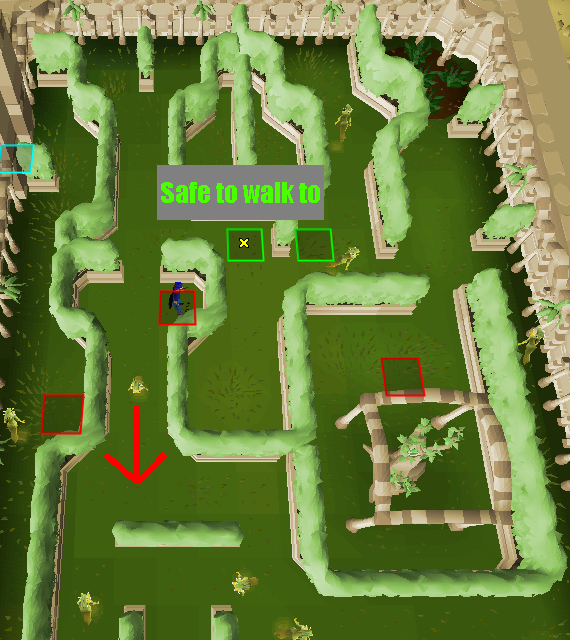
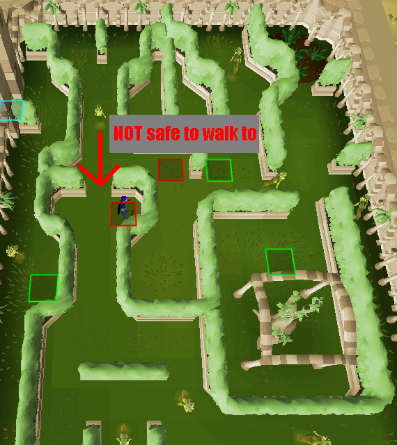

# Sorceress' Spring Garden

The [Sorceress' Garden](https://oldschool.runescape.wiki/w/Sorceress%27s_Garden) 
is a minigame located in south-western Al Kharid 
useful for training thieving or collecting herbs.
This plugin helps show when it is safe to move to the next tile
by changing the tile's color to green or red when it's not safe.

### Plugin Usage

Start by standing on the cyan colored tile just inside the gate. 
When the next tile turns green it means that you can click on it and move to it safely.
When the next tile is red it means that it is not safe to move to it and that you should wait.
After going through the maze a couple of times with the plugin active you will get the hang of it, 
and you will be able to anticipate when the next tile will turn green.

Here's an image showing when to click:

And here's an image showing when NOT to click:

Although this may sound complicated,
after a couple runs you'll have the hang of it.

### Future plugin updates
Adding a number above the tiles to show when they are expected to turn green

Adding the same functionality to the other gardens (Winter, Autumn, and Summer)

Adding a sound effect when it is safe to move to the next tile

Adding an overlay to show how many runs have been made/failed, how many fruits have been collected, 
    and how much experience you will get from the current amount of drinks in your inventory